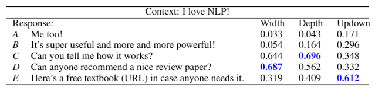

# DialogRPT: a pretrained dialog response ranking model

How likely a dialog response is upvoted by people and/or trigger more replies? This is what [DialogRPT](arxiv) is learned to predict.
It is a dialog response ranking transformer-based model trained on millions of human feedback data, presented at [EMNLP'20](https://2020.emnlp.org/).



## Interactive Demo

Please check out this [Colab Notebook](colab) for an interactive demo.


## Install

```
git clone https://github.com/golsun/DialogRPT
cd DialogRPT
pip install .
```
Download the pretrained models

| Task     | Pretrained model |
| :------------- | :-----------: |
| **Human feedback: <br> given a context and its two human responses, predict...**|     |
|  ... which gets more upvotes? | [updown.pth](https://xiagnlp2.blob.core.windows.net/dialogrpt/updown.pth) |
| ... which gets more direct replies? | [width.pth](https://xiagnlp2.blob.core.windows.net/dialogrpt/width.pth) |
|  ... which gets longer follow-up thread? | [depth.pth](https://xiagnlp2.blob.core.windows.net/dialogrpt/depth.pth) |
| **Human-like: <br> given a context and one human response, distinguish it with...** |    |
| ... a random human response | [human_vs_rand.pth](https://xiagnlp2.blob.core.windows.net/dialogrpt/human_vs_rand.pth) |
| ... a machine generated response | [human_vs_gen.pth](https://xiagnlp2.blob.core.windows.net/dialogrpt/human_vs_gen.pth) |


## Data

**Step 1.** Download the `.bz2` files from this [third-party dump](https://files.pushshift.io/reddit/), including both [comments](https://files.pushshift.io/reddit/comments/) and [submissions](https://files.pushshift.io/reddit/submissions/). The following is the example command to download the first month, `2011-01`. To reproduce the model, please download all three-year data, from `2011-01` to `2013-12`.
```bash
mkdir "data/bz2"
wget https://files.pushshift.io/reddit/comments/RC_2011-01.bz2 -P data/bz2
wget https://files.pushshift.io/reddit/submissions/RS_2011-01.bz2 -P data/bz2
# TODO: repeat the above wget commands with other months
```
**Step 2.** Read the `.bz2` files and group items from the same subreddit and extract basic attributes and dialog trees.
```bash
python src/data.py bz2 2011
python src/data.py basic 2011
# TODO: repeat the above command with 2012 and 2013
```
**Step 3.** Build training and testing data for different feedback signals. 
```bash
python src/data.py updown 2011
python src/data.py depth 2011
python src/data.py width 2011
# TODO: repeat the above command with 2012 and 2013
```
The expected file structure in `data` folder is shown below.
The final `train.tsv` and `vali.tsv` files (e.g. in `data/out/updown`) are used to train the model. One may use `vali.tsv` from a future non-overlapping year as the test set. (We used 2011-2012 for train/vali and 2013 for test)


```bash
├── data
   └── bz2
       ├── RC_2011-01.bz2          # downloaded
       ├── RS_2011-01.bz2
       ├── ...
   └── jsonl
       ├── 2011-01_edges.tsv       # generated by `python src/data.py bz2`
       ├── 2011-01_nodes.jsonl
       ├── 2011-01_roots.jsonl
       ├── ...
   └── subs
       ├── AskReddit
           ├── 2011_feedback.tsv   # generated by `python src/data.py basic`
           ├── 2011_time.tsv
           ├── 2011_trees.pkl
           ├── 2011_txt.tsv
           ├── 2011_updown.tsv     # generated by `python src/data.py updown`
           ├── 2011_updown_ids.tsv
           ├── 2011_depth.tsv      # generated by `python src/data.py depth`
           ├── 2011_depth_ids.tsv
           ├── 2011_width.tsv      # generated by `python src/data.py width`
           ├── 2011_width_ids.tsv
           └── ...
       └── ...
   └── out
       ├── updown     # generated by `python src/data.py updown`
           ├── raw.tsv
           ├── raw.tsv.train
           ├── raw.tsv.test
           ├── train.tsv
           ├── vali.tsv
       ├── depth      # generated by `python src/data.py depth`
           └── ...
       └── width      # generated by `python src/data.py width`
           └── ...
```

## Training
We use [DialoGPT](https://github.com/microsoft/DialoGPT) to initialize the model. Please download at
```
python src/main.py train --data=data/out/updown
```


## Evaluation

