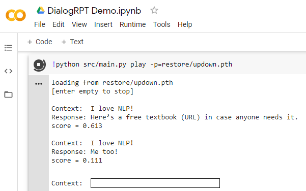

<p align="center">
    <br>
    
    <br>
<p>

# **Dialog** **R**anking **P**retrained **T**ransformers

How likely a dialog response is upvoted 👍 and/or gets replied 💬? 

This is what **DialogRPT** is learned to predict.
It is a set of dialog response ranking models proposed by [Microsoft Research NLP Group](https://www.microsoft.com/en-us/research/group/natural-language-processing/) trained on millions of human feedback data. 
It can be used to improve existing dialog generation model (e.g., [DialoGPT](https://github.com/microsoft/DialoGPT)) by re-ranking the generated response candidates.
See our [EMNLP paper](https://arxiv.org/abs/2009.06978/) for more details. 

Links
* [Paper](https://arxiv.org/abs/2009.06978/)
* [Demo](https://colab.research.google.com/drive/1jQXzTYsgdZIQjJKrX4g3CP0_PGCeVU3C?usp=sharing)
* [Discussion on Reddit](https://www.reddit.com/r/MachineLearning/comments/iurfdf/r_this_model_predicts_which_reddit_comment_gets/)
* [An inventory of MSR NLP team projects](https://github.com/microsoft/MSR-NLP-Projects)

## Quick Start (TL;DR)

### Interactive Demo
Please check out this [Colab Notebook](https://colab.research.google.com/drive/1jQXzTYsgdZIQjJKrX4g3CP0_PGCeVU3C?usp=sharing) for an interactive demo.

In the following example, the model predicts that, given the same context *"I love NLP!"*, the response *"Here’s a free textbook (URL) in case anyone needs it."* is more likely to be upvoted than the response *"Me too!"*.




### Ranking dialog responses
Use our models as a evaluation/ranking metric for dialog response generation. The input file (`--data`) is tab-separated, in format `context \t response0 \t response1 ...`. See example [input file](https://github.com/golsun/DialogRPT/blob/master/doc/toy.tsv)
* Using a single ranker (see [expected output](https://github.com/golsun/DialogRPT/blob/master/doc/toy.tsv.updown.jsonl))
```bash
python src/score.py rank --data=doc/toy.tsv -p=restore/updown.pth
# downloading pretrained model to restore/updown.pth
# 100% [....................] 1520029114 / 1520029114
# loading from restore/updown.pth
# ranking doc/toy.tsv
# totally processed 2 line, avg_hyp_score 0.264, top_hyp_score 0.409
# results saved to doc/toy.tsv.ranked.jsonl
# results can be read with function `read_ranked_jsonl`
```
* Using an ensemble model (see [expected output](https://github.com/golsun/DialogRPT/blob/master/doc/toy.tsv.ensemble.jsonl))
```bash
python src/score.py rank --data=doc/toy.tsv -p=restore/ensemble.yml
```

## Install

**Step 1.** Download the repo
```
git clone https://github.com/golsun/DialogRPT
cd DialogRPT
```
**Step 2.** Install the packages
```
conda create -n dialogrpt python=3.6
conda activate dialogrpt
pip install -r requirements.txt
```
**Step 3.** Although the pretrained models will be downloaded when you need to load them, you can choose to download the them manually with
```bash
wget https://xiagnlp2.blob.core.windows.net/dialogrpt/updown.pth -P restore
# TODO: download other models using the links in the table below
```

| Description    | Task | Pretrained model |
| :------------- | :-----------: | :-----------: |
| **Human feedback**: <br> given a context and its two human responses, predict...|     |
|  ... which gets more upvotes? | `updown` | [download](https://xiagnlp2.blob.core.windows.net/dialogrpt/updown.pth) |
| ... which gets more direct replies? | `width` | [download](https://xiagnlp2.blob.core.windows.net/dialogrpt/width.pth) |
|  ... which gets longer follow-up thread? | `depth` | [download](https://xiagnlp2.blob.core.windows.net/dialogrpt/depth.pth) |
| **Human-like** (i.e., human vs fake): <br> given a context and one human response, distinguish it with... |    |
| ... a random human response | `human_vs_rand` | [download](https://xiagnlp2.blob.core.windows.net/dialogrpt/human_vs_rand.pth) |
| ... a machine generated response | `human_vs_machine` | [download](https://xiagnlp2.blob.core.windows.net/dialogrpt/human_vs_machine.pth) |


## Data

**Step 1.** Download the `.bz2` files from this [third-party dump](https://files.pushshift.io/reddit/), including both [comments](https://files.pushshift.io/reddit/comments/) and [submissions](https://files.pushshift.io/reddit/submissions/). The following is the example command to download the first month, `2011-01`. To reproduce the model training, please download all data for year 2011 and 2012, i.e., from `2011-01` to `2012-12`.
```bash
mkdir "data/bz2"
wget https://files.pushshift.io/reddit/comments/RC_2011-01.bz2 -P data/bz2
wget https://files.pushshift.io/reddit/submissions/RS_2011-01.bz2 -P data/bz2
# TODO: repeat the above wget commands with months from `2011-01` to `2012-12`
```
**Step 2.** Read the `.bz2` files and group items from the same subreddit and extract basic attributes and dialog trees.
```bash
python src/data.py bz2 2011
python src/data.py basic 2011
# TODO: repeat the above command with 2012
```
**Step 3.** Build training and testing data for different feedback signals. 
```bash
python src/data.py updown 2011
python src/data.py depth 2011
python src/data.py width 2011
# TODO: repeat the above command with 2012
```
The expected file structure in `data` folder is shown below. The final `train.tsv` and `vali.tsv` files (e.g. in `data/out/updown`) are used to train and validate the model. 

We used `vali.tsv` from year `2013` as the test set (thus no overlap with the train/vali data built above with year `2011-2012`). You can [download test sets](https://xiagnlp2.blob.core.windows.net/dialogrpt/test.zip) and follow instructions in section **Evaluation** beblow for its use.


```bash
├── data
   └── bz2
       ├── RC_2011-01.bz2          # downloaded
       ├── RS_2011-01.bz2
       ├── ...
   └── jsonl
       ├── 2011-01_edges.tsv       # generated by `python src/data.py bz2`
       ├── 2011-01_nodes.jsonl
       ├── 2011-01_roots.jsonl
       ├── ...
   └── subs
       ├── AskReddit
           ├── 2011_feedback.tsv   # generated by `python src/data.py basic`
           ├── 2011_time.tsv
           ├── 2011_trees.pkl
           ├── 2011_txt.tsv
           ├── 2011_updown.tsv     # generated by `python src/data.py updown`
           ├── 2011_updown_ids.tsv
           ├── 2011_depth.tsv      # generated by `python src/data.py depth`
           ├── 2011_depth_ids.tsv
           ├── 2011_width.tsv      # generated by `python src/data.py width`
           ├── 2011_width_ids.tsv
           └── ...
       └── ...
   └── out
       ├── updown     # generated by `python src/data.py updown`
           ├── raw.tsv
           ├── raw.tsv.train
           ├── raw.tsv.vali
           ├── train.tsv
           ├── vali.tsv
       ├── depth      # generated by `python src/data.py depth`
           └── ...
       └── width      # generated by `python src/data.py width`
           └── ...
```

## Training
We use [DialoGPT](https://github.com/microsoft/DialoGPT) to initialize the model. Please download with
```
wget https://convaisharables.blob.core.windows.net/lsp/multiref/medium_ft.pkl -P restore
```
For the human feedback prediction tasks, we specify `min_score_gap` and `min_rank_gap` to only validate on less-noisy samples (not applied to training).
```
python src/main.py train --data=data/out/updown -p=restore/medium_ft.pkl --min_score_gap=20 --min_rank_gap=0.5
python src/main.py train --data=data/out/depth -p=restore/medium_ft.pkl --min_score_gap=4 --min_rank_gap=0.5
python src/main.py train --data=data/out/width -p=restore/medium_ft.pkl --min_score_gap=4 --min_rank_gap=0.5
```
For `human_vs_rand` task, use the `--mismatch` flag to feed rand human response as negative examples. We can reuse previous dataset (e.g. `data/out/updown`).
```
python src/main.py train --data=data/out/updown -p=restore/medium_ft.pkl --mismatch
```
For `human_vs_machine` task, we build dataset by pair human response with a response generated by [DialoGPT](https://github.com/microsoft/DialoGPT) with topk decoding
```
python src/main.py train --data=data/out/human_vs_machine -p=restore/medium_ft.pkl
```

We trained all models on a Nvidia V100 4-core GPU (each core with 32G memory) with the following hyperparameters. Checkpoint with the best validation accuracy is used as final model.
| Argument    | Value |  Description |
| :------------- | :-----------: |:------------- | 
| `batch`    | 256 | total batch size for all GPUs. | 
| `vali_size`    | 1024 | number of samples used for validation (i.e. dev set size). | 
| `lr` | 3e-05 | learning rate |
| `max_seq_len` | 50 | max allowed sequence length. <br> if longer, leading tokens will be truncated |
| `max_hr_gap` | 1 | max allowed hour difference between positive and negative samples. <br> If longer, this pair will be discarded for train/vali|

## Play

Please see the **Interactive Demo** above to run in Colab.

To run locally, use the following command to test a single model (e.g. `restore/updown.pth`)
```bash
python src/main.py play -p=restore/updown.pth
# or use path of another trained model for -p
```
You can also play the ensemble model, which involves multiple models defined in its [config file](restore/ensemble.yml) (see this file for details). 
```bash
python src/main.py play -p=restore/ensemble.yml
```

## Evaluation

Please [download test](https://xiagnlp2.blob.core.windows.net/dialogrpt/test.zip) (or use the command below)
```
wget https://xiagnlp2.blob.core.windows.net/dialogrpt/test.zip
unzip test.zip
```

### Human feedback prediction

The performance on `updown`, `depth`, and `width` can be measured with the following commands, respectively.
The `--min_score_gap` and `--min_rank_gap` arguments are consistent with the values used to measure validation loss during training.
```
python src/score.py eval_human_feedback -p=restore/updown.pth --data=test/human_feedback/updown.tsv --min_score_gap=20 --min_rank_gap=0.5
python src/score.py eval_human_feedback -p=restore/depth.pth --data=test/human_feedback/depth.tsv --min_score_gap=4 --min_rank_gap=0.5
python src/score.py eval_human_feedback -p=restore/width.pth --data=test/human_feedback/width.tsv --min_score_gap=4 --min_rank_gap=0.5
```

The expected pairwise accuracy on 5000 test samples is listed in the table below (from Table 5 of the [paper](https://arxiv.org/abs/2009.06978)). Note even by random guess one can get accuracy of 0.500.
| human feedback     | `updown` | `depth` | `width` |
| :-------------      | :------: |:------------: |:--------: |
| Dialog ppl.         |  0.488   | 0.508         | 0.513     | 
| Reverse dialog ppl. |  0.560   | 0.557         | 0.571     | 
| **DialogRPT** (ours)| **0.683** | **0.695**  | **0.752** | 

### Human-like classification

* `human_vs_rand` task: Although the model is trained on `reddit` corpus only, we measured its **zero-shot** performance on several unseen corpora (`twitter`, `dailydialog` and `personachat`)
```bash
python src/score.py eval_human_vs_rand -p=restore/human_vs_rand.pth --data=test/human_vs_fake/reddit
python src/score.py eval_human_vs_rand -p=restore/human_vs_rand.pth --data=test/human_vs_fake/dailydialog
python src/score.py eval_human_vs_rand -p=restore/human_vs_rand.pth --data=test/human_vs_fake/twitter
python src/score.py eval_human_vs_rand -p=restore/human_vs_rand.pth --data=test/human_vs_fake/personachat
```
The expected `hits@k` metric on 5000 test samples is listed in the table below (from Table 7 of the [paper](https://arxiv.org/abs/2009.06978)).
`hits@k` measures, for the same context, given `k` positive responses and `n` negative responses, how many positive responses are in top-`k` of the ranked responses.
| `human_vs_rand`     | `reddit` | `dailydialog` | `twitter` | `personachat` |
| :-------------      | :------: |:------------: |:--------: |:------------: |
| BM25                |  0.309   | 0.182         | 0.178     | 0.117         |
| Dialog ppl.         |  0.560   | 0.176         | 0.107     | 0.108         |
| Reverse dialog ppl. |  0.775   | 0.457         | 0.440     | 0.449         |
| [ConveRT](https://arxiv.org/abs/1911.03688) |  0.760   | 0.380         | 0.439     | 0.197         |
| **DialogRPT** (ours)| **0.886** | **0.621**  | **0.548** | **0.479**     |

* `human_vs_machine` task: its performance is only evaluated for `reddit` corpus. 
```bash
python src/score.py --task=eval_human_vs_machine -p=restore/human_vs_machine.pth --data=test/human_vs_fake/reddit
# expecting accuracy ~0.98
```


## Citation
If you use our dataset or model, please cite our [paper](https://arxiv.org/abs/2009.06978)

```
@inproceedings{gao2020dialogrpt,
    title={Dialogue Response RankingTraining with Large-Scale Human Feedback Data},
    author={Xiang Gao and Yizhe Zhang and Michel Galley and Chris Brockett and Bill Dolan},
    year={2020},
    booktitle={EMNLP}
}
```
